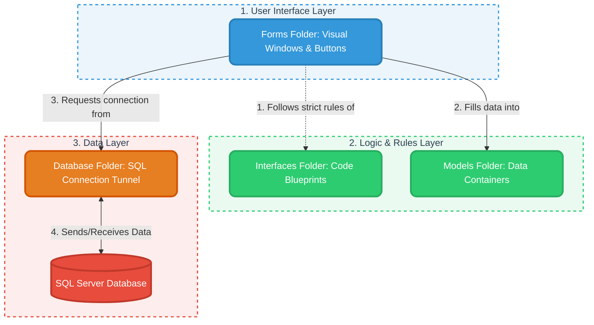
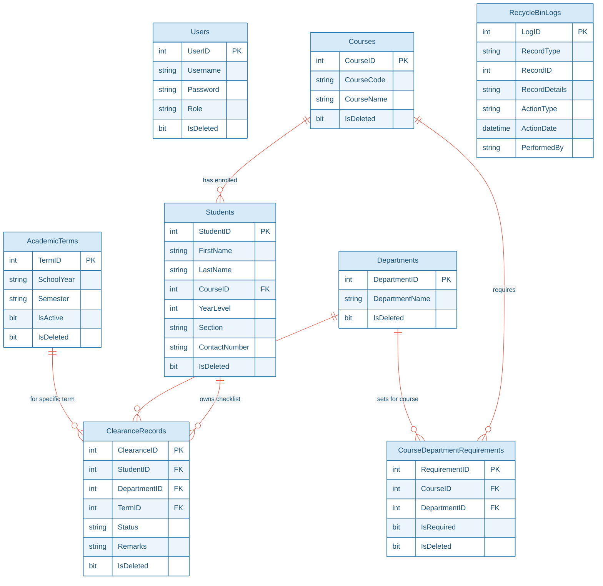

# Student Clearance Management System
## 📚 Comprehensive System & Code Documentation

This documentation serves as an all-in-one learning resource and detailed system blueprint for the **Student Clearance Management System**. It is designed specifically to explain the architecture, design choices, database connection patterns, model declarations, and form operations to both beginners and intermediate developers.

---

## 📋 Table of Contents
1.  **🏗️ System Architecture Overview**
2.  **🗄️ Database Entity-Relationship (ER) Diagram**
3.  **💎 OOP (Object-Oriented Programming) in Action**
4.  **🗃️ The Database Layer (`Database/`)**
5.  **🔌 The Interfaces Layer (`Interfaces/`)**
6.  **📦 The Models Layer (`Models/`)**
7.  **🎨 The User Interface Layer (`Forms/`)**
8.  **🍎 Real-Life Analogy Sheet (For Absolute Beginners)**
9.  **🗄️ SQL Commands & Code Mapping (Every Database Query Explained)**

---

## 1. 🏗️ System Architecture Overview

This application is built using a **Layered Architecture**. By decoupling data mapping, operational logic, database connections, and user interface layouts, the codebase remains clean, easy to maintain, and highly secure.

Here is a beginner-friendly visual of how the different folders communicate with each other:



> [!NOTE]
> **Folder Structure Summary:**
> *   **`Database/`**: Establishes links to SQL Server. Contains the core connection string.
> *   **`Interfaces/`**: Enforces blueprints (contracts) for consistent data operations across forms.
> *   **`Models/`**: Declares plain C# entities (classes with properties) mapping directly to database tables.
> *   **`Forms/`**: Renders all visual panels and executes behind-the-scenes event logic.

---

## 2. 🗄️ Database Entity-Relationship (ER) Diagram

The system relies on a well-structured relational database. Below is the Entity-Relationship mapping showing how all the tables connect to each other through Primary Keys (PK) and Foreign Keys (FK).



> [!IMPORTANT]
> Notice that every main table has an `IsDeleted` bit column. This supports safe **"Soft Deletions"** (moving things to a Recycle Bin) instead of permanent, destructive deletion of data!

---

## 3. 💎 OOP (Object-Oriented Programming) in Action

Understanding Object-Oriented Programming (OOP) is crucial for beginners. This project implements the **four pillars of OOP** in a highly visible manner.

### A. 🧬 Inheritance (Reusing Code)
Inheritance allows one class (the child) to automatically inherit the variables and methods of another class (the parent), preventing redundant coding.

```csharp
// Parent Class (Base Class)
public class User
{
    public int UserID { get; set; }
    public string Username { get; set; }
    public string Password { get; set; }
    public string Role { get; set; }
}

// Child Class (Derived Class)
public class Admin : User
{
    public bool CanManageRecords()
    {
        return true; // Admin gets User fields + this custom method
    }
}
```
> [!TIP]
> **Why it's great for beginners:** Placing a colon `:` followed by `User` instantly gives the `Admin` class access to `UserID`, `Username`, `Password`, and `Role` variables without re-writing them!

### B. 🔒 Encapsulation (Securing State)
Encapsulation packages fields and code into a single unit (a class) and restricts external code from directly tampering with internal variables. We use **Properties** with getters (`get`) and setters (`set`) to control this.

```csharp
public static class AppSession
{
    public static int LoggedInUserID { get; set; }
    public static string LoggedInUsername { get; set; } = string.Empty;
    public static string LoggedInRole { get; set; } = string.Empty;
}
```
> [!TIP]
> **Why it's great for beginners:** If we want a property to be *read-only* (so external classes can look at it but never change it), we can simply remove the `set;` accessor!

### C. 📐 Abstraction (Simplifying Complex Systems)
Abstraction hides complex background logic and shows only the necessary interface rules. In C#, we use **Interfaces** as abstract blueprints.

```csharp
public interface ICrud
{
    void Add();
    void Update();
    void Delete();
}
```
> [!TIP]
> **Why it's great for beginners:** An interface contains **zero execution code**. It is a strict contract that says: *"If a form manages records, it MUST define its own Add, Update, and Delete methods."*

### D. 🦄 Polymorphism (One Blueprint, Many Implementations)
Polymorphism allows different classes to implement the same interface or method in custom ways.

```csharp
// Inside StudentForm.cs
public void Add()
{
    // INSERT INTO Students ... (saves StudentID, FirstName, LastName)
}

// Inside CourseForm.cs
public void Add()
{
    // INSERT INTO Courses ... (saves CourseID, CourseCode, CourseName)
}
```
> [!TIP]
> **Why it's great for beginners:** Even though both forms run a method called `Add()`, the way they insert data is completely custom to their unique characteristics!

---

## 4. 🗃️ The Database Layer (`Database/`)

### File: `DBConnection.cs`
This class stores the connection parameters needed to link the C# application to MS SQL Server and returns an active `SqlConnection` object.

```csharp
using Microsoft.Data.SqlClient;

namespace Student_Clearance_Management_System.Database
{
    public class DBConnection
    {
        private string connectionString =
            @"Server=DESKTOP-INU2S9E\MSSQLSERVER01;Database=StudentClearanceDB;Trusted_Connection=True;TrustServerCertificate=True;";

        public SqlConnection GetConnection()
        {
            return new SqlConnection(connectionString);
        }
    }
}
```

> [!NOTE]
> **The Connection String Breakdown:**
> *   `Server=...`: The host computer name and local SQL Server instance.
> *   `Database=...`: The active database containing our tables.
> *   `Trusted_Connection=True`: Uses Windows credentials directly (highly secure, no hardcoded password).
> *   `TrustServerCertificate=True`: Connects securely even if local encryption certificates aren't fully registered.

---

## 5. 🔌 The Interfaces Layer (`Interfaces/`)

### File: `ICrud.cs`
This interface sets up standard guidelines for administrative modules.

```csharp
namespace Student_Clearance_Management_System.Interfaces
{
    public interface ICrud
    {
        void Add();
        void Update();
        void Delete();
    }
}
```

---

## 6. 📦 The Models Layer (`Models/`)

Models are standard C# classes representing the database tables. They act as data-transfer objects.

### A. `User.cs` & `Admin.cs`
Used for credential mappings. `Admin` inherits from `User` to demonstrate class extension rules.

### B. `AppSession.cs`
A static class that persists in memory during the entire application session. It stores who is currently logged in, their active security role, and the selected Academic Term.

```csharp
public static class AppSession
{
    public static int LoggedInUserID { get; set; }
    public static string LoggedInUsername { get; set; } = string.Empty;
    public static string LoggedInRole { get; set; } = string.Empty;
    public static int SelectedTermID { get; set; }
    public static string SelectedTermText { get; set; } = string.Empty;
}
```

> [!WARNING]
> **Why use `string.Empty`? (CRASH PREVENTION)**
> Notice that we write `= string.Empty;` instead of just leaving it blank.
> If we leave it blank, C# defaults the text variable to `null` (which means it absolutely does not exist yet). If our code tries to read a `null` variable to check a user's role before anyone has actually logged in, the program will instantly crash with a dreaded `NullReferenceException` (Object reference not set to an instance of an object). 
> By assigning it to `string.Empty`, we give it a safe, blank text value (`""`), preventing any unexpected crashes!

### C. `Students.cs`
Represents the Student Entity with properties like `StudentID`, `FirstName`, `Course`, and `YearLevel`.

### D. `Courses.cs` & `Department.cs`
Represent the educational tracks (`CourseID`, `CourseCode`) and institutional departments (`DepartmentID`, `DepartmentName`) that approve clearances.

### E. `ClearanceRecord.cs`
Represents individual clearance status flags mapping `StudentID` to a `DepartmentID` with a `Status` ("Pending" / "Cleared").

---

## 7. 🎨 The User Interface Layer (`Forms/`)

Visual Studio WinForms uses **Partial Classes** to separate the user interface layout from the developer's C# database code:
*   `FormName.Designer.cs`: Handles button sizes, grid columns, font families, and pixel coordinates.
*   `FormName.cs`: Handles database queries, inputs, button click routines, and data operations.

---

### A. `LoginForm.cs`
This form validates security credentials. When the user clicks the login button, it queries the `Users` table:

```csharp
string query = @"SELECT UserID, Username, Password, Role
                 FROM Users
                 WHERE Username = @username
                 AND Password = @password
                 AND IsDeleted = 0";

SqlCommand cmd = new SqlCommand(query, conn);
cmd.Parameters.AddWithValue("@username", txtUsername.Text);
cmd.Parameters.AddWithValue("@password", txtPassword.Text);
```

> [!CAUTION]
> **Safe Parameterization (SQL Injection Protection):**
> Beginners often use string concatenation: `WHERE Username = '` + `txtUsername.Text` + `'`.
> If a hacker enters `' OR '1'='1` in the textbox, SQL Server executes the query as true, letting them log in without credentials. Using `@username` with `cmd.Parameters.AddWithValue` forces SQL Server to treat the textbox contents strictly as text, rendering hacking attempts useless!

---

### B. `Dashboard.cs`
This is the central navigation panel.
*   **Dynamic Role Visibility**: During `Dashboard_Load`, if `AppSession.LoggedInRole != "Admin"`, the "Recycle Bin" button is hidden. This ensures standard users never see administrative functions.
*   **Stats Loaders**: Queries database counts using SQL's `COUNT(*)` function and updates dashboard counters.

---

### C. `StudentForm.cs` (Demonstrating SQL Transactions)
When managing students, deletions must be handled safely. In production environments, we utilize a **Soft Delete** where we change `IsDeleted` to `1` rather than permanently erasing the database row.

To make sure both the student and their clearance records are deleted together, we use a **Database Transaction (`SqlTransaction`)**:

```csharp
SqlTransaction transaction = conn.BeginTransaction();
try
{
    // Step 1: Soft delete Student
    SqlCommand cmd1 = new SqlCommand("UPDATE Students SET IsDeleted = 1 WHERE StudentID = @id", conn, transaction);
    cmd1.Parameters.AddWithValue("@id", txtID.Text);
    cmd1.ExecuteNonQuery();

    // Step 2: Soft delete corresponding Clearance Records
    SqlCommand cmd2 = new SqlCommand("UPDATE ClearanceRecords SET IsDeleted = 1 WHERE StudentID = @id", conn, transaction);
    cmd2.Parameters.AddWithValue("@id", txtID.Text);
    cmd2.ExecuteNonQuery();

    // Step 3: Record Audit Entry in RecycleBinLogs
    SqlCommand logCmd = new SqlCommand("INSERT INTO RecycleBinLogs...", conn, transaction);
    logCmd.ExecuteNonQuery();

    transaction.Commit(); // Save changes permanently
}
catch (Exception ex)
{
    transaction.Rollback(); // If one query fails, undo ALL changes!
}
```

---

### D. `RecycleBinForm.cs` (Advanced Data Safety)
Allows admins to view deleted items in a ComboBox-selected DataGridView, review delete history logs, and restore items safely.

#### 🔒 Active Dependency Check (Data Integrity):
If a student's course is still deleted in the Recycle Bin, restoring the student would lead to database corruption. Our code actively blocks this:
```csharp
if (isCourseDeleted)
{
    throw new InvalidOperationException($"Cannot restore student because their course is deleted. Please restore the course first.");
}
```

---

### E. `ReportForm.cs`
This form provides data compilation. It fetches clearance status and aggregates percentages.
*   **CSV Exporter**: Uses a file-stream writer (`StreamWriter`) to parse grid results and export clearance status details directly into Microsoft Excel/CSV files.

---

## 8. 🍎 Real-Life Analogy Sheet (For Absolute Beginners)

| Technical Term | Real-Life Analogy | Explanation |
| :--- | :--- | :--- |
| **Database** | A large **Filing Cabinet** | Stores records in labeled cabinets (tables). |
| **Connection String** | A physical **Street Address** | Tells our code exactly where the cabinet is located (server instance). |
| **Model** | Labeled **Plastic Boxes** | A box labeled "Student Box" can only hold student items (Name, ID, Section). It matches the layout exactly. |
| **Interface (`ICrud`)** | A **Restaurant Menu** | Lists operations you can execute (Add, Update, Delete). It doesn't write the code; it just defines what is available. |
| **Inheritance** | **Family DNA** | A child inherits height or hair color from their parent, but grows up to add their own custom features. |
| **SQL Parameters** | A **Luggage Scanner** at a gate | Checks passenger items to make sure they are harmless cargo, not database hacking commands (SQL Injection). |
| **SqlTransaction** | A **Vending Machine** | You select a drink and insert coins. Either you get the drink AND your coins are charged, or the machine fails, returns your coins, and keeps the drink. No half-completed transactions! |
| **Soft Delete** | **Archive Folder** | Instead of shredding a paper folder (Hard Delete), you put a red "Archived" sticker on it (Soft Delete) and place it in the bottom drawer (Recycle Bin). |

---

## 9. 🗄️ SQL Commands & Code Mapping (Every Database Query Explained)

Structured Query Language (SQL) is the universal language used to communicate with databases. Below is a unified, beginner-friendly guide showing **exactly what each SQL command means, a real-life analogy, and where it is executed in our C# files**:

### A. `SELECT` & `FROM` (The Retrievers)
*   **What it does:** Instructs the database to go inside a table and pull out specific columns of data.
*   **🍎 Real-Life Analogy:** Ordering food from a menu. You ask for three specific items (`CourseID`, `CourseCode`, `CourseName`) from the restaurant kitchen (`Courses` table).
*   **📍 Where it is used in our C# files:**
    *   **In [LoginForm.cs](file:///c:/Users/MSI/OneDrive/Desktop/C%23/Student%20Clearance%20Management%20System/Forms/LoginForm.cs)**: Verifies user credentials and sets permissions.
        ```sql
        SELECT UserID, Username, Password, Role FROM Users WHERE Username = @username AND Password = @password AND IsDeleted = 0
        ```
    *   **In [CourseForm.cs](file:///c:/Users/MSI/OneDrive/Desktop/C%23/Student%20Clearance%20Management%20System/Forms/CourseForm.cs)**: Fetches existing active courses to fill the UI grid.
        ```sql
        SELECT CourseID, CourseCode, CourseName FROM Courses WHERE IsDeleted = 0
        ```

### B. `WHERE` (The Filter)
*   **What it does:** Restricts the database search so you only retrieve records that meet your rules.
*   **🍎 Real-Life Analogy:** Going shopping for clothes but telling the clerk: "Only show me shirts **where** the color is blue".
*   **📍 Where it is used in our C# files:**
    *   **Used in all forms** to enforce soft-deletion parameters (ignoring items moved to the Recycle Bin):
        ```sql
        SELECT * FROM Students WHERE IsDeleted = 0
        ```
    *   **In [StudentForm.cs](file:///c:/Users/MSI/OneDrive/Desktop/C%23/Student%20Clearance%20Management%20System/Forms/StudentForm.cs)**: Targets a single student record during updates.
        ```sql
        WHERE StudentID = @id
        ```

### C. `INSERT INTO` & `VALUES` (The Creator)
*   **What it does:** Creates and writes a brand-new row of information into a database table.
*   **🍎 Real-Life Analogy:** Filling out a brand-new blank library card and sliding it into the filing drawer cabinet.
*   **📍 Where it is used in our C# files:**
    *   **In [StudentForm.cs](file:///c:/Users/MSI/OneDrive/Desktop/C%23/Student%20Clearance%20Management%20System/Forms/StudentForm.cs)**: Adds a new student record to the system.
        ```sql
        INSERT INTO Students (StudentID, FirstName, LastName, CourseID, YearLevel, Section, ContactNumber, IsDeleted) 
        VALUES (@id, @first, @last, @courseId, @year, @section, @contact, 0)
        ```
    *   **In [RecycleBinForm.cs](file:///c:/Users/MSI/OneDrive/Desktop/C%23/Student%20Clearance%20Management%20System/Forms/RecycleBinForm.cs)**: Writes log entries in the `RecycleBinLogs` history whenever a record is deleted or restored.
        ```sql
        INSERT INTO RecycleBinLogs (RecordType, RecordID, RecordDetails, ActionType, ActionDate, PerformedBy)
        VALUES ('Student', @recordId, @details, 'Delete', GETDATE(), @username)
        ```

### D. `UPDATE` & `SET` (The Editor)
*   **What it does:** Modifies values within already-existing table rows.
*   **🍎 Real-Life Analogy:** Taking an existing student record out of a drawer and scribbling their new phone number on it.
*   **📍 Where it is used in our C# files:**
    *   **In [StudentForm.cs](file:///c:/Users/MSI/OneDrive/Desktop/C%23/Student%20Clearance%20Management%20System/Forms/StudentForm.cs)**: Executes safe **soft-deletion** by changing `IsDeleted` state.
        ```sql
        UPDATE Students SET IsDeleted = 1 WHERE StudentID = @id
        ```
    *   **In [AcademicTermForm.cs](file:///c:/Users/MSI/OneDrive/Desktop/C%23/Student%20Clearance%20Management%20System/Forms/AcademicTermForm.cs)**: Sets all semesters inactive first, then sets the selected term as the single active semester.
        ```sql
        UPDATE AcademicTerms SET IsActive = 0;
        UPDATE AcademicTerms SET IsActive = 1 WHERE TermID = @id;
        ```
*   > [!WARNING]
    > **CRITICAL RULE:** Always pair `UPDATE` commands with a `WHERE` filter! If you run `UPDATE Students SET IsDeleted = 1` without the `WHERE` clause, SQL Server will mark **every student in the database** as deleted!

### E. `INNER JOIN` & `ON` (The Connector)
*   **What it does:** Merges two separate tables together by matching rows that share a common column.
*   **🍎 Real-Life Analogy:** Connect-the-dots matching. You have a "Students" list with a `CourseID` number (like `3`), and a separate "Courses" list. `INNER JOIN` looks up the Courses list, finds ID `3`, and matches it to display `"BSIT"` next to the student's name in a single view.
*   **📍 Where it is used in our C# files:**
    *   **In [StudentForm.cs](file:///c:/Users/MSI/OneDrive/Desktop/C%23/Student%20Clearance%20Management%20System/Forms/StudentForm.cs)**: Displays human-readable Course Codes in the grid rather than a confusing database number.
        ```sql
        SELECT s.StudentID, s.FirstName, s.LastName, c.CourseCode, s.YearLevel, s.Section, s.ContactNumber 
        FROM Students s 
        INNER JOIN Courses c ON s.CourseID = c.CourseID 
        WHERE s.IsDeleted = 0
        ```
    *   **In [ReportForm.cs](file:///c:/Users/MSI/OneDrive/Desktop/C%23/Student%20Clearance%20Management%20System/Forms/ReportForm.cs)**: Combines students, courses, departments, and clearance checklist statuses for CSV exports.
        ```sql
        SELECT s.StudentID, s.FirstName, s.LastName, c.CourseCode, d.DepartmentName, cr.Status, cr.Remarks 
        FROM ClearanceRecords cr 
        INNER JOIN Students s ON cr.StudentID = s.StudentID 
        INNER JOIN Departments d ON cr.DepartmentID = d.DepartmentID 
        INNER JOIN Courses c ON s.CourseID = c.CourseID 
        WHERE cr.TermID = @termId AND cr.IsDeleted = 0
        ```

### F. `ORDER BY` (The Organizer)
*   **What it does:** Sorts your retrieved data alphabetically or chronologically (using `ASC` for oldest/A-Z, or `DESC` for newest/Z-A).
*   **🍎 Real-Life Analogy:** Organizing a stack of invoice receipts on your desk by date, placing the **newest** bills on top.
*   **📍 Where it is used in our C# files:**
    *   **In [RecycleBinForm.cs](file:///c:/Users/MSI/OneDrive/Desktop/C%23/Student%20Clearance%20Management%20System/Forms/RecycleBinForm.cs)**: Sorts audit history entries so that the most recent delete and restore operations are displayed at the very top of the list.
        ```sql
        SELECT LogID, RecordType, RecordDetails, ActionType, ActionDate, PerformedBy 
        FROM RecycleBinLogs 
        ORDER BY ActionDate DESC
        ```

### G. `LIKE` (The Searcher)
*   **What it does:** Searches for partial text matches inside a text column using wildcards (`%`).
*   **🍎 Real-Life Analogy:** Searching for the name "Smith" in a phone directory. `LIKE '%Smith%'` matches "John **Smith**", "**Smith**son", and "Gold**smith**".
*   **📍 Where it is used in our C# files:**
    *   **In [StudentForm.cs](file:///c:/Users/MSI/OneDrive/Desktop/C%23/Student%20Clearance%20Management%20System/Forms/StudentForm.cs)**: Filters the grid in real-time as you type in the search bar.
        ```sql
        SELECT s.StudentID, s.FirstName, s.LastName, c.CourseCode, s.YearLevel, s.Section, s.ContactNumber 
        FROM Students s 
        INNER JOIN Courses c ON s.CourseID = c.CourseID 
        WHERE (s.FirstName LIKE @search OR s.LastName LIKE @search OR s.StudentID LIKE @search) AND s.IsDeleted = 0
        ```
        *(In C#, the parameter is bound as `"%"` + `txtSearch.Text` + `"%"`)*

### H. `COUNT(*)` & Aggregate Functions (The Calculators)
*   **What it does:** Performs calculations on your database table to find total record counts.
*   **🍎 Real-Life Analogy:** Head-counting students standing in a classroom line.
*   **📍 Where it is used in our C# files:**
    *   **In [Dashboard.cs](file:///c:/Users/MSI/OneDrive/Desktop/C%23/Student%20Clearance%20Management%20System/Forms/Dashboard.cs)**: Loads active numbers dynamically onto stat cards.
        *   *Total Active Students*: `SELECT COUNT(*) FROM Students WHERE IsDeleted = 0`
        *   *Total Active Courses*: `SELECT COUNT(*) FROM Courses WHERE IsDeleted = 0`
        *   *Total Active Departments*: `SELECT COUNT(*) FROM Departments WHERE IsDeleted = 0`
    *   **In [Dashboard.cs](file:///c:/Users/MSI/OneDrive/Desktop/C%23/Student%20Clearance%20Management%20System/Forms/Dashboard.cs)**: Calculates the count of unique students cleared or pending clearance for the active term.
        ```sql
        SELECT COUNT(DISTINCT StudentID) FROM ClearanceRecords 
        WHERE Status = 'Cleared' AND TermID = @termId AND IsDeleted = 0
        ```
